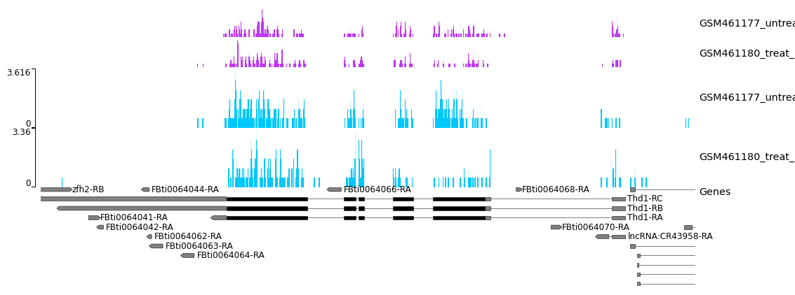
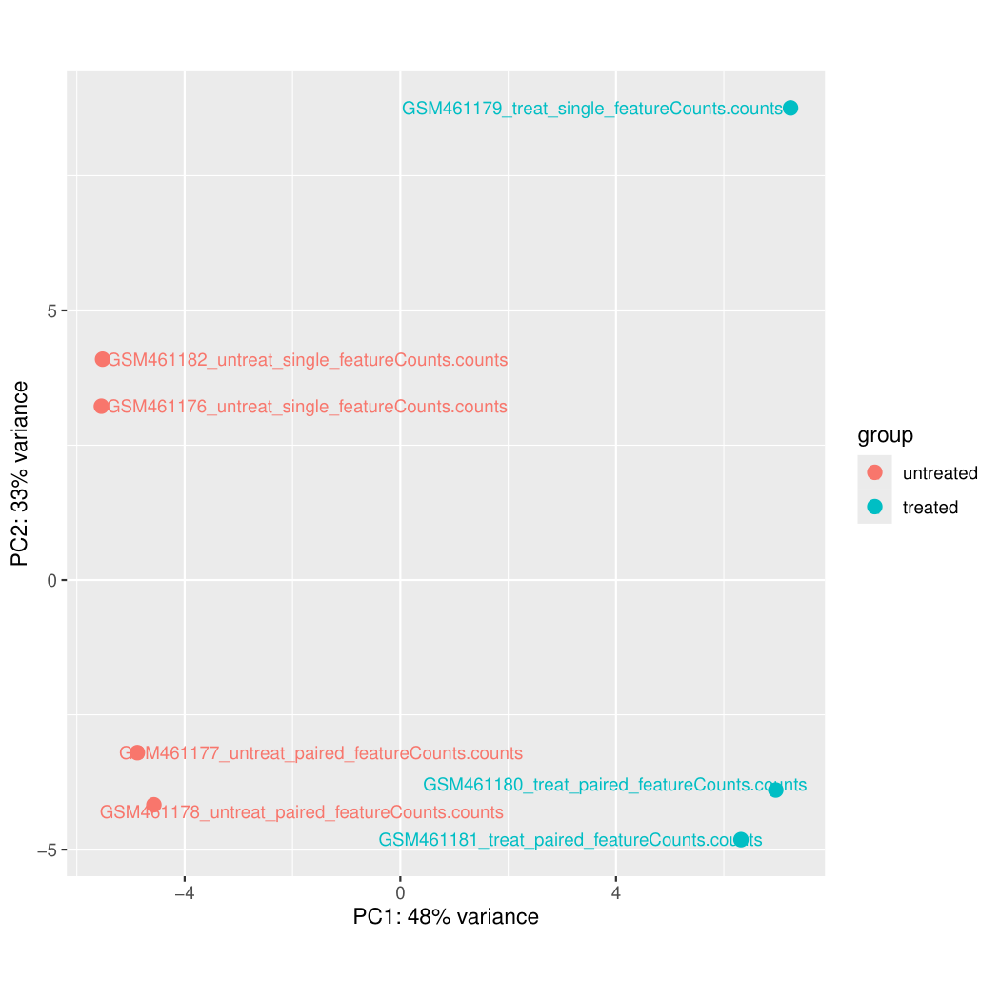
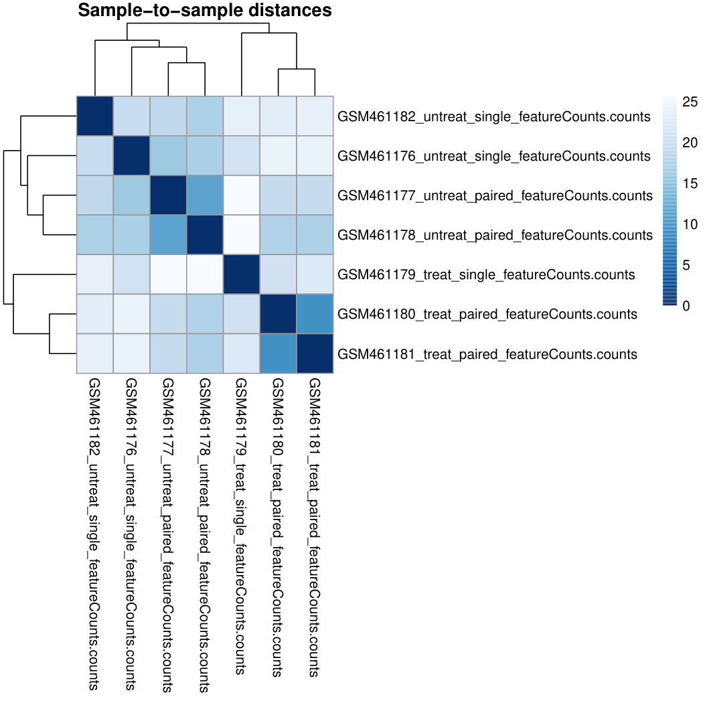
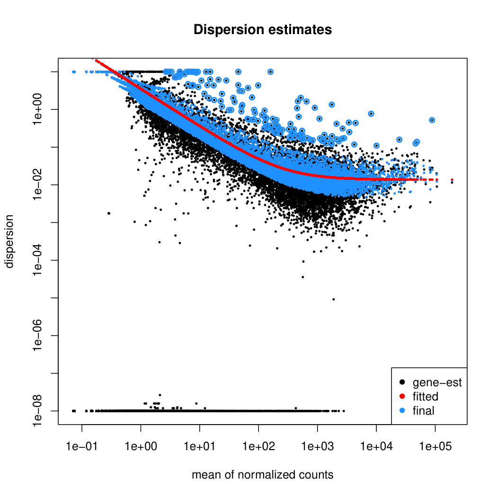
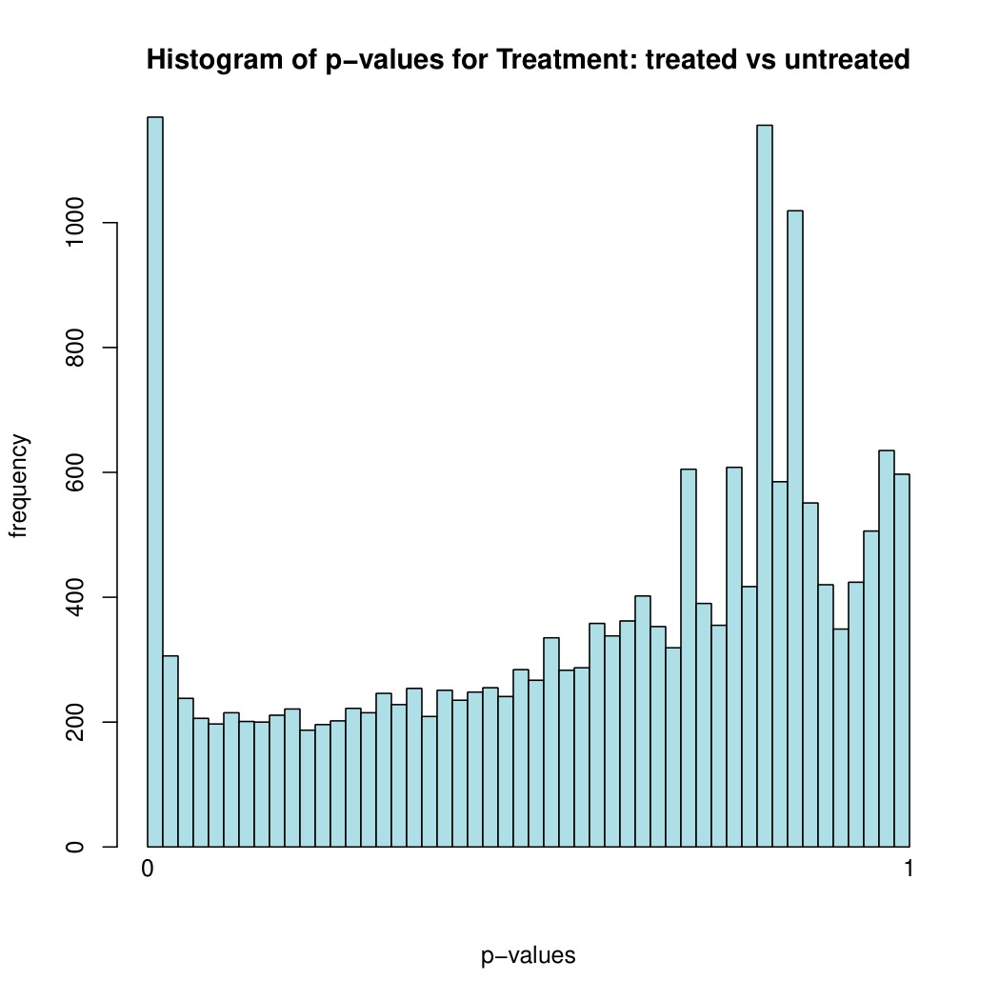
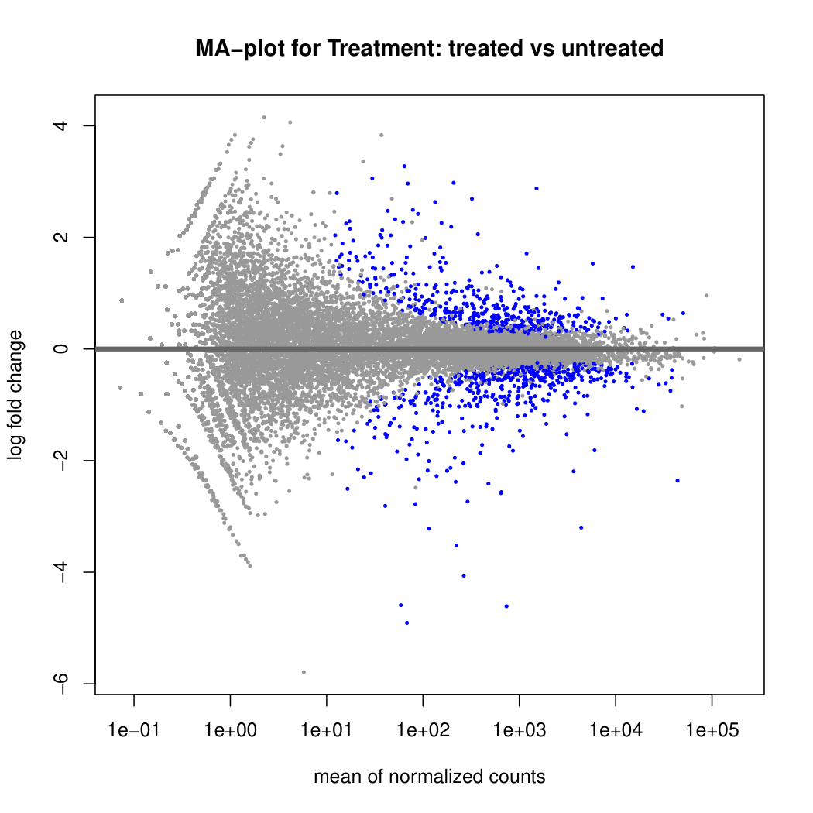
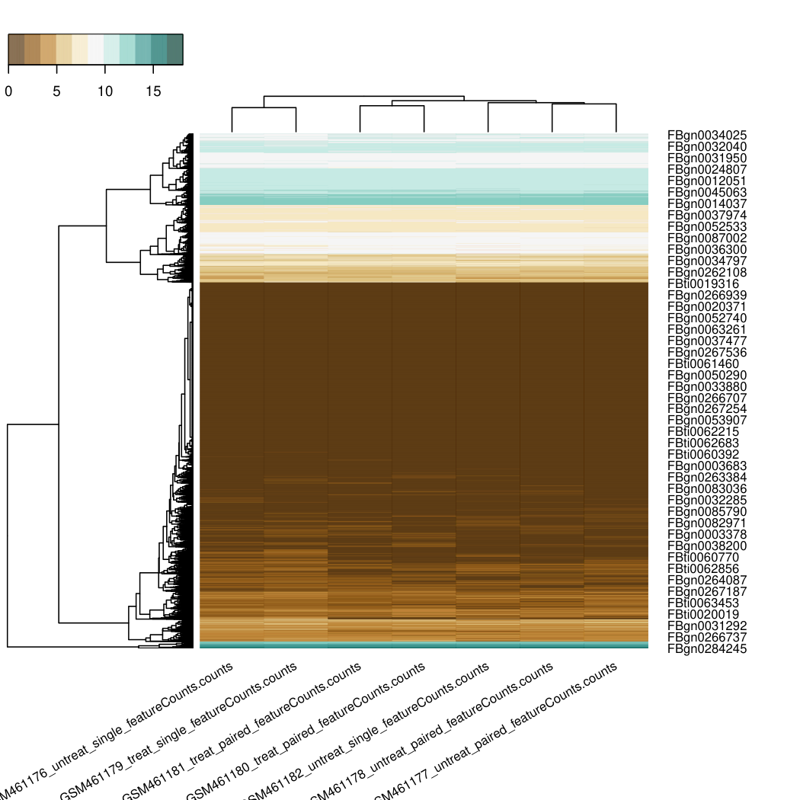

# Reference-Based RNA-Seq Analysis — Galaxy Tutorial

> **Course:** BI-436 — Special Topics in Bioinformatics
> **Student:** Nawal Babar
> **Platform:** Galaxy (usegalaxy.org / usegalaxy.eu)
> **Organism:** *Drosophila melanogaster* (dm6)
> **Tutorial:** [GTN — Reference-based RNA-Seq data analysis](https://training.galaxyproject.org/training-material/topics/transcriptomics/tutorials/ref-based/tutorial.html)

[](https://usegalaxy.org)
[](https://www.ncbi.nlm.nih.gov/datasets/taxonomy/7227/)

---

## Biological Question

What genes are differentially expressed when the **Pasilla (PS) splicing factor** is knocked down in *Drosophila melanogaster*?

The PS gene is the *Drosophila* homologue of human **Nova-1/Nova-2** splicing regulators. By depleting PS via RNAi and comparing RNA-Seq data from treated vs untreated samples, we can identify which genes and pathways it regulates.

---

## Pipeline Overview

```
Raw FASTQ reads (treated + untreated samples)
        │
        ▼
    Falco + MultiQC  ──────────────────► Quality control report
        │
        ▼
    Cutadapt  ─────────────────────────► Trimmed reads (Q≥20, len≥20)
        │
        ▼
    RNA STAR (splice-aware aligner)  ──► BAM files mapped to dm6
        │
        ├──► pyGenomeTracks  ───────────► Strand coverage plots
        └──► Infer Experiment (RSeQC)  ─► Library strandness
        │
        ▼
    featureCounts  ─────────────────────► Read counts per gene
        │
        ▼
    DESeq2  ────────────────────────────► DE genes (treated vs untreated)
        │
        ├──► PCA plot          ─────────► Sample clustering
        ├──► Sample distance   ─────────► Sample similarity heatmap
        ├──► Dispersion plot   ─────────► Model fit quality
        ├──► MA plot           ─────────► Fold change vs expression
        ├──► p-value histogram ─────────► Distribution of significance
        └──► heatmap2          ─────────► DE gene expression heatmap
```

---

## Repository Structure

```
RNA-Seq-Galaxy/
├── README.md
├── images/
│   ├── mapping/
│   │   └── pygenometracks_coverage.png
│   ├── deseq2/
│   │   ├── deseq2_plot_page1.png   ← PCA plot
│   │   ├── deseq2_plot_page2.png   ← Sample-to-sample distances
│   │   ├── deseq2_plot_page3.png   ← Dispersion estimates
│   │   ├── deseq2_plot_page4.png   ← p-value histogram
│   │   └── deseq2_plot_page5.png   ← MA plot
│   └── heatmap/
│       └── heatmap_page1.png       ← DE gene expression heatmap
└── part2_differential_expression/
    ├── deseq2_results/
    │   ├── Galaxy11-[DESeq2 result file...].tabular
    │   ├── Galaxy12-[DESeq2 plots...].pdf
    │   ├── Galaxy13-[Normalized counts...].tabular
    │   └── Galaxy14-[Annotated results...].tabular
    └── heatmap/
        └── Galaxy16-[heatmap2...].pdf
```

---

## Dataset

Data from NCBI GEO: [GSE18508](https://www.ncbi.nlm.nih.gov/geo/query/acc.cgi?acc=GSE18508) — Brooks et al. 2011

| Sample | Condition | Type |
|--------|-----------|------|
| GSM461176 | Untreated | Single-end |
| GSM461177 | Untreated | Paired-end |
| GSM461178 | Untreated | Paired-end |
| GSM461182 | Untreated | Single-end |
| GSM461179 | Treated (PS depleted) | Single-end |
| GSM461180 | Treated (PS depleted) | Paired-end |
| GSM461181 | Treated (PS depleted) | Paired-end |

---

## Part 1 — Raw Reads to Counts (usegalaxy.org)

### Step 1 — Quality Control (Falco + MultiQC)

Raw reads were quality-checked with **Falco** and reports combined with **MultiQC**, then adapter-trimmed with **Cutadapt** (quality cutoff Q20, minimum length 20 bp).

### Step 2 — Splice-Aware Mapping (RNA STAR)

Trimmed reads were mapped to the *D. melanogaster* **dm6** reference genome using **RNA STAR** — a splice-aware aligner essential for eukaryotic RNA-Seq because reads frequently span exon-exon junctions caused by splicing.

- Both samples achieved **>80% unique alignment rate** ✅
- Low multi-mapping rate (<10%) confirms good data quality

### Step 3 — Strand Coverage Visualisation (pyGenomeTracks)

Aligned reads were visualised at a representative genomic region. The coverage tracks show reads piling up precisely over annotated exons, with strand-specific patterns confirming correct mapping orientation.



> **How to read this:** Each coloured track represents read coverage on one strand across a genomic window. Peaks align with annotated exons (shown at the bottom). The strand symmetry confirms the library is **unstranded** — reads map to both strands equally.

### Step 4 — Library Strandness (RSeQC Infer Experiment)

RSeQC compared read orientations against known gene orientations:

```
Fraction explained by "1++,1--,2+-,2-+": ~0.49
Fraction explained by "1+-,1-+,2++,2--": ~0.48
```

**Conclusion: Unstranded library** — used as the `Unstranded` setting in featureCounts.

### Step 5 — Read Counting (featureCounts)

Reads overlapping annotated exons were counted per gene (unstranded, minimum mapping quality 10). This produces the count matrix used as input for DESeq2.

---

## Part 2 — Differential Expression Analysis (usegalaxy.eu)

Pre-made featureCounts outputs for all 7 samples were imported and analysed with **DESeq2**, using two factors: **treatment** (treated vs untreated) and **sequencing type** (paired-end vs single-end) to control for technical variation.

---

### Step 6 — PCA Plot

Principal Component Analysis of normalised counts. Each point is one sample.



> **How to read this:** PC1 (48% variance) separates treated from untreated samples — the largest source of variation in the dataset is the PS knockdown, exactly as expected. PC2 (33% variance) separates paired-end from single-end libraries — showing the sequencing type effect we controlled for with the second factor in DESeq2. Clear separation between red (untreated) and blue (treated) clusters confirms a strong, reliable treatment effect.

---

### Step 7 — Sample-to-Sample Distance Heatmap

Euclidean distances between all sample pairs based on normalised counts.



> **How to read this:** Dark blue = samples that are most similar. Samples cluster into two groups — treated and untreated — with replicates within each group being most similar to each other. This confirms good replicate reproducibility and a clear between-group difference.

---

### Step 8 — Dispersion Estimates

DESeq2 models gene-wise variance (dispersion) to distinguish true biological signal from noise.



> **How to read this:** Black dots = per-gene dispersion estimates. The red line = fitted trend (dispersion decreases as mean expression increases — genes expressed at higher levels are more precisely estimated). Blue dots = final shrunk estimates used for testing. The convergence of estimates toward the fitted line shows the DESeq2 model fit is working well, stabilising estimates for lowly expressed genes.

---

### Step 9 — p-value Histogram

Distribution of raw p-values across all tested genes.



> **How to read this:** A well-behaved DE experiment produces a p-value histogram with a **spike near 0** (truly DE genes) and a flat uniform distribution for the rest (non-DE genes). This is exactly what we see here — confirming the statistical test is working correctly and there is a genuine treatment effect.

---

### Step 10 — MA Plot

Fold change (M) vs mean expression (A) for every gene tested.



> **How to read this:** Each dot is one gene. X-axis = mean normalised expression. Y-axis = log2 fold change (treated vs untreated). **Blue dots = significantly DE genes** (adjusted p < 0.05). Genes above 0 are upregulated in treated; below 0 are downregulated. The spread of significant genes across a range of expression levels (not just highly expressed genes) shows the analysis has good power.

---

### Step 11 — DE Gene Expression Heatmap

Normalised expression of significantly DE genes across all 7 samples, hierarchically clustered.



> **How to read this:** Rows = DE genes, columns = samples. Red = high expression, blue = low expression. Two major clusters are visible: genes **upregulated in treated** (high in blue columns) and genes **downregulated in treated** (high in red columns). Samples within each condition cluster together, confirming consistent expression patterns across replicates.

---

## Key Results Summary

| Metric | Result |
|--------|--------|
| Mapping rate | >80% unique alignment to dm6 ✅ |
| Library strandness | Unstranded (confirmed by RSeQC) |
| PCA separation | Clear treated vs untreated separation on PC1 (48% variance) ✅ |
| Pasilla gene (FBgn0261552) | Confirmed **downregulated** in treated samples ✅ |
| p-value distribution | Spike near 0 — genuine DE signal confirmed ✅ |
| Heatmap clustering | Treated and untreated samples cluster separately ✅ |

---

## Tools Used

| Tool | Version | Purpose |
|------|---------|---------|
| Falco | 1.2.4+galaxy0 | Raw read QC |
| MultiQC | 1.27+galaxy4 | Aggregate QC reports |
| Cutadapt | 5.2+galaxy0 | Adapter trimming |
| RNA STAR | 2.7.11b+galaxy0 | Splice-aware mapping |
| pyGenomeTracks | 3.9+galaxy0 | Coverage visualisation |
| Infer Experiment (RSeQC) | 5.0.3+galaxy0 | Strandness detection |
| featureCounts | 2.1.1+galaxy0 | Gene-level read counting |
| DESeq2 | 2.11.40.8+galaxy2 | Differential expression |
| heatmap2 | 3.2.0+galaxy1 | Expression heatmap |

---

## Notes

- Part 1 used **subsampled** FASTQ files for speed — this reduces the number of detectable DE genes compared to the full dataset, which is expected.
- Two Galaxy servers were used: **usegalaxy.org** for Part 1, **usegalaxy.eu** for Part 2.

---

## References

- Brooks et al. 2011 — [Conservation of an RNA regulatory map between Drosophila and mammals](https://www.ncbi.nlm.nih.gov/pmc/articles/PMC3032923/)
- Dobin et al. 2013 — [STAR: ultrafast universal RNA-seq aligner](https://academic.oup.com/bioinformatics/article/29/1/15/272537)
- Love et al. 2014 — [Moderated estimation of fold change and dispersion for RNA-seq data with DESeq2](https://genomebiology.biomedcentral.com/articles/10.1186/s13059-014-0550-8)
- GTN Tutorial — [Reference-based RNA-Seq data analysis](https://training.galaxyproject.org/training-material/topics/transcriptomics/tutorials/ref-based/tutorial.html)

---

*Submitted as part of BI-436 Special Topics in Bioinformatics coursework — Nawal Babar, 2026*
